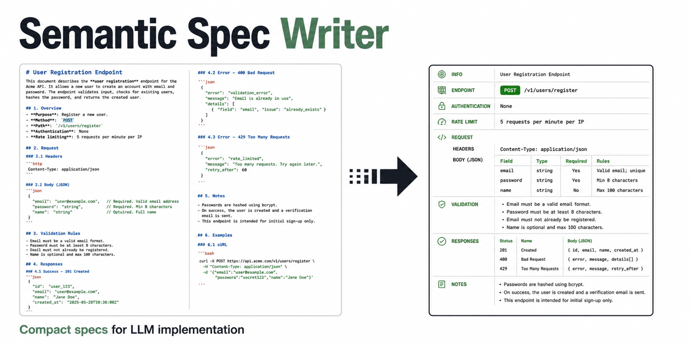

# Semantic Spec Writer

[](https://github.com/gvozdb/semantic-spec-writer-skill/actions/workflows/benchmark.yml)
[](LICENSE)



Semantic Spec Writer turns plans, technical specifications, architecture notes, and acceptance criteria into a compact semantic format for LLMs.

It writes `.plan.ctx` and `.spec.ctx` files. Each file is instruction-complete,
so an implementation agent can read it without installing the skill. Repository
execution packets are intentionally bound to the validated repository snapshot.

## What it does

- converts verbose Markdown into compact `rules`, `flows`, `tasks`, and `acceptance` blocks;
- preserves exact file names, API routes, tables, fields, commands, and error codes;
- moves unresolved requirements into `open_questions` instead of inventing answers;
- allows short explanations as comment lines starting with `#`;
- keeps domain vocabulary local to each specification;
- compiles repository handoffs into file-owned `do` actions with validated source anchors and stale-route detection;
- compiles Packet v3 plus exact routed source into sealed Capsule v6 execution context with an edit-before-verify gate and sealed next-action focus.

## Benefits

- reduces the document size that agents and humans need to inspect;
- makes ambiguity visible before implementation starts;
- links requirements to tasks and acceptance criteria;
- replaces broad repository discovery with a bounded, stale-checked edit route;
- can remove downstream discovery and read turns by supplying routed source before execution;
- stays readable for both humans and LLMs;
- lets implementation agents read the output directly.

## Comparison

| Approach | Document size | Requirement precision | Implementation readiness | Main risk |
|---|---:|---:|---:|---|
| Regular Markdown | Usually larger | Depends on the author | Medium | Key details get buried in prose |
| Short summary | Smaller | Low to medium | Low | Conditions and edge cases get dropped |
| Semantic Spec Writer | Smaller in the benchmark | High when `acceptance` is complete | High | Too much compression without review |

Actual token savings depend on the source language, document structure, and tokenizer. Measure savings on real documents rather than comparing file sizes in bytes.
New lifecycle reports therefore recompute only byte/word document compression
from attested bytes and omit document-token reduction unless tokenizer identity
and counts become independently verifiable. The published table below is an
immutable historical result.

## Benchmark

The benchmark uses eight paired Python tasks with held-out acceptance tests.
The semantic documents are generated by the published skill from the Markdown
sources, not hand-selected after implementation. Failed generation attempts are
retained and included in lifecycle cost.

Published `gpt-5.6-terra`, medium-reasoning run:

| Measure | Result |
|---|---:|
| Generated specs valid | 8/8 |
| Implementation task success | 100% Markdown, 100% Semantic |
| Median document token reduction (`o200k_base`) | 28.28% |
| Context-only median input reduction | 0.794% |
| Full-loop total input tokens | 9.29% fewer |
| Full-loop uncached input tokens | 7.31% fewer |
| Full-loop output tokens | 5.84% fewer |
| Full-loop agent wall time | 5.25% lower |

The context-only run completed 48/48 fixed-output reads with zero tool calls and
saved 816 input tokens per complete eight-document corpus read. Its
fixture-cluster 95% confidence interval for median input reduction was
`[0.185%, 0.949%]`.

The implementation run completed 48/48 isolated coding tasks. Its total-input
median confidence interval was positive, but its uncached-input interval crossed
zero. Treat the uncached, output, and latency totals as observed results for this
corpus, not universal performance guarantees.

Converting an existing document has a one-time authoring cost. In this run, that
cost broke even after 13 full-corpus reuses for total input tokens, 17 for
uncached input tokens, and 15 for output tokens. A one-off conversion costs more
than using the original document. For new work, author the semantic spec directly
instead of creating a prose draft first.

### Execution packet benchmark

Packet v3 adds a repository-bound edit route and a bounded execution loop to the
same Semantic v1 requirements. A separate 27-run benchmark isolates that packet
benefit from ordinary prose compression:

| Measure | Semantic v1 | Packet v3 | Packet result |
|---|---:|---:|---:|
| Successful tasks | 6/9 | 9/9 | 100% success |
| Acceptance tests | 94.67% | 100% | All tests passed |
| Total input tokens | 708,429 | 690,958 | 2.47% fewer |
| Uncached input tokens | 120,653 | 105,998 | 12.15% fewer |
| Output tokens | 19,509 | 19,233 | 1.41% fewer |
| Agent wall time | 462.362s | 451.832s | 2.28% lower |
| Shell commands | 25 | 25 | No increase |

This establishes a measured quality gain on the three multi-file fixtures. The
all-run token reductions are observed results, not a universal savings claim:
only 6/9 pairs were jointly successful, and the equal-success uncached-token
confidence interval crossed zero.

### Context capsule benchmark

Capsule v6 embeds a validated Packet v3 and its exact routed source snapshot.
Its sealed control identifies source frames as current pre-edit data, rejects a
no-edit outcome, and requires every routed edit in one bundled file-change
operation before any repository read or command. The exact declared verification
then runs alone exactly once; any additional tool call fails the action gate. The
mandatory `do` list is repeated beside each source frame so the model does not
have to cross-reference a global route while constructing the one-shot patch. A
sealed next-action record after the final source frame repeats only the mutation
paths and required first `file_change`; it deliberately omits `V1` so the tail
cannot prime an early command. The leading control owns the full
`file_change -> V1 -> final answer` sequence. Provider prompts use the
`capsule-v6-next-action-1` profile: no conflicting generic syntax check and no
competing instruction after the artifact. The
two-arm harness compares Capsule v6 directly with Packet v3, securely compares
every routed post-state with the captured starter, and fails no-edit, partial
edit, split-edit, pre-edit command, substituted verification, or multi-attempt
outcomes. It
reports behavior, provider telemetry, and byte-auditable static overhead.

Published `gpt-5.6-terra`, medium-reasoning Capsule v6 run:

| Measure | Packet v3 | Capsule v6 | Capsule result |
|---|---:|---:|---:|
| Task success | 9/9 | 9/9 | 100% preserved |
| Acceptance tests | 100% | 100% | All tests passed |
| Total model tokens | 727,365 | 454,192 | 37.56% fewer |
| Uncached input tokens | 105,462 | 85,751 | 18.69% fewer |
| Output tokens | 18,767 | 10,809 | 42.40% fewer |
| Agent wall time | 434.703s | 278.693s | 35.89% lower |
| Tool calls | 35 | 18 | 48.57% fewer |
| Discovery/read commands | 21/20 | 0/0 | Eliminated in this corpus |

All 9/9 Capsule runs passed the exact routed-action gate. The fixture-cluster
95% confidence interval for total-token reduction was
`[23.282%, 38.629%]`. Capsule bytes were 222.46% larger at the median, so the
gain came from eliminating downstream discovery and read turns, not static
compression. These are measured corpus results, not a universal guarantee. See
the [rendered Capsule report](CAPSULE_BENCHMARK.md) and
[privacy-redacted result](benchmarks/results/published/gpt-5.6-terra-medium-20260903-context-capsule-v6/capsule-r3.json).

The result and exact rendered report pass an isolated release credibility
validator. That gate runs with Python
`-I` from the launcher's exact `HEAD` Git blob, then attests the live launcher
and harness blobs. It permits only the root report, two README claim files, and
one non-executable published directory containing `capsule-r3.json` plus a
byte-identical `CAPSULE.md` after the clean run commit. Attested validators
execute from verified Git-blob bytes, not live paths, and the empty code stage
rejects stdlib import shadows before other Python checks run. Release
validation is non-executing: fixture behavior is
tested during the benchmark run, while publication replays only structural,
snapshot, provenance, privacy, and rendering checks. Those checks use a private
fixture tree materialized from the attested Git commit, never live fixture
paths. Repository code/config changes, import shadows, bytecode caches,
additional result directories, symlinks, renames, copies, deletions, and mode
or type changes fail closed.

Artifacts generated by the current harness are privacy-redacted by default.
The earlier generated and Packet result directories linked below are historical
legacy artifacts that contain raw telemetry. Treat those two as **unsanitized,
non-secret-only** reference material; they are not privacy-safe artifacts.

```bash
python3 benchmarks/benchmark.py validate
python3 benchmarks/benchmark.py static --check
python3 benchmarks/benchmark.py run --provider mock --repetitions 1
```

See the [implementation report](BENCHMARK.md),
[context report](CONTEXT_BENCHMARK.md),
[lifecycle report](LIFECYCLE_BENCHMARK.md),
[execution packet report](HANDOFF_BENCHMARK.md),
[Capsule v6 report](CAPSULE_BENCHMARK.md),
[historical artifacts — unsanitized, non-secret-only](benchmarks/results/published/gpt-5.6-terra-medium-20260901-generated/),
[historical Packet artifacts — unsanitized, non-secret-only](benchmarks/results/published/gpt-5.6-terra-medium-20260902-execution-packet/),
and [methodology and commands](benchmarks/README.md).

## Project layout

```text
semantic-spec-writer-skill/
|-- README.md
|-- LICENSE
|-- benchmarks/
`-- skills/
    `-- semantic-spec-writer/
        `-- SKILL.md
```

Run all commands below from the `semantic-spec-writer-skill` directory.

## Quick install

Install from GitHub with the [Agent Skills CLI](https://www.skills.sh/docs/cli):

```bash
npx skills add gvozdb/semantic-spec-writer-skill
```

The manual Codex and Claude Code instructions below remain available when a
third-party installer is not desired.

## Install in Codex

Codex loads personal skills from `$HOME/.agents/skills` and project skills from `.agents/skills`.

Install for all projects:

```bash
mkdir -p "$HOME/.agents/skills/semantic-spec-writer"
cp -R skills/semantic-spec-writer/. "$HOME/.agents/skills/semantic-spec-writer/"
```

Install in one project:

```bash
mkdir -p /path/to/project/.agents/skills/semantic-spec-writer
cp -R skills/semantic-spec-writer/. /path/to/project/.agents/skills/semantic-spec-writer/
```

Check the installation and invoke the skill:

```text
/skills
$semantic-spec-writer Convert docs/feature.md into an implementation-ready .spec.ctx file
```

Codex usually detects skill changes automatically. Restart Codex if the skill doesn't appear in `/skills`.

[Official Codex Skills documentation](https://developers.openai.com/codex/skills)

## Install in Claude Code

Claude Code loads personal skills from `$HOME/.claude/skills` and project skills from `.claude/skills`.

Install for all projects:

```bash
mkdir -p "$HOME/.claude/skills/semantic-spec-writer"
cp -R skills/semantic-spec-writer/. "$HOME/.claude/skills/semantic-spec-writer/"
```

Install in one project:

```bash
mkdir -p /path/to/project/.claude/skills/semantic-spec-writer
cp -R skills/semantic-spec-writer/. /path/to/project/.claude/skills/semantic-spec-writer/
```

Check the installation and invoke the skill:

```text
/skills
/semantic-spec-writer Convert docs/feature.md into an implementation-ready .spec.ctx file
```

Claude Code watches existing skill directories for changes. Restart Claude Code if `.claude/skills` was created after the current session started.

[Official Claude Code Skills documentation](https://docs.anthropic.com/en/docs/claude-code/skills)

## Usage

Example prompts:

```text
Convert this technical specification to a compact .spec.ctx file.
Create an implementation plan as .plan.ctx from this issue and the current codebase.
Rewrite docs/auth.md as a self-contained semantic spec without inventing requirements.
Create a repository execution packet for this issue with the smallest complete edit route.
Compile this validated execution packet into a Capsule v6 handoff.
```

## Repository execution packets

For a coding handoff, the skill can compile requirements into a task-specific
route instead of appending a file list to a complete spec. Every existing or new
target owns one or more `do` actions. A SHA-256 basis over routed files detects
stale packets before implementation. Packet v3 also carries a bounded execution
loop: one routed read, one implementation pass, one declared verification, then
stop on success.

Validate a packet and its optional context budget:

```bash
python3 skills/semantic-spec-writer/scripts/check_execution_packet.py \
  /path/to/repository /path/to/task.spec.ctx \
  --encoding o200k_base \
  --max-context-tokens 4000
```

Use `--print-basis` while authoring, then place the returned
`route-sha256:<hash>` under `basis` and run the normal validation once.

The separate three-arm benchmark compares Markdown, Semantic v1, and compiled
Packet v3 on the same multi-file tasks. Packet v3 versus Semantic v1 is the
primary comparison; see [methodology and commands](benchmarks/README.md).

For a costly handoff or repeated execution, compile the validated packet and
its routed source into Capsule v6:

```bash
python3 skills/semantic-spec-writer/scripts/context_capsule.py build \
  /path/to/repository /path/to/task.spec.ctx /secure/path/task.capsule.ctx

python3 skills/semantic-spec-writer/scripts/context_capsule.py check \
  /path/to/repository /secure/path/task.capsule.ctx \
  --packet /path/to/task.spec.ctx
```

Capsules copy source code. Store them with repository-equivalent access
controls. Use Packet v3 directly when one small task does not justify the
Capsule's larger initial context. Secure CLI publication is Linux/POSIX-only
and fails closed when descriptor-relative no-follow or atomic publication
primitives are unavailable.

Semantic compression is lossy. Before handing a document to an implementation agent, review `acceptance`, exact identifiers, and `open_questions`.
